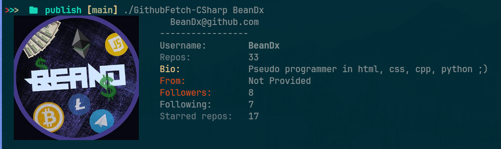
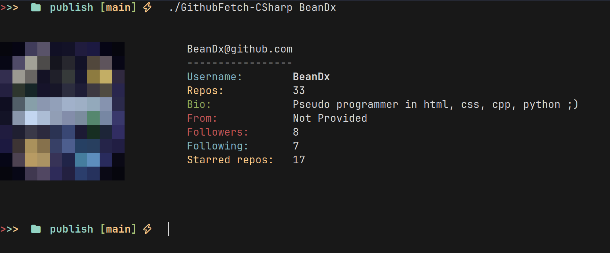

# GitFetch-CSharp

<p align="center">
  
    
</p>

A simple command-line tool to fetch and display your GitHub statistics in a style reminiscent of Neofetch. This project is a C#/.NET port of the original Python project [githubfetch by isa-programmer](https://github.com/isa-programmer/githubfetch).

---

### Table of Contents
* [About The Project](#about-the-project)
* [Pros](#pros--cons)
* [Installation](#installation)
* [A Note from the Developer](#a-note-from-the-developer)
* [Acknowledgements](#acknowledgements)
* [License](#license)

---

## About The Project

`GitFetch-CSharp` reads your local Git configuration to get your username and then uses the GitHub API to pull your public statistics. It displays information like your total number of repositories, stars received, followers, and more, right in your terminal.

The main goal was to port the functionality of the original Python tool to the .NET ecosystem, allowing it to run natively on Windows, macOS, and Linux with a single binary.

## Pros & Cons

#### ✔️ Pros
* **Cross-Platform:** Runs on Windows, macOS, and Linux without any changes.
* **Single Binary:** Minimal number of dependencies (unlike python)
* **Speed:** Works faster than python

---

## Installation

You have two options for installing `GitFetch-CSharp`.

### 1. From a Release (Recommended)

This is the easiest way to get started.

1.  Go to the [**Releases Page**](https://github.com/BeanDx/GitFetchCSharp/releases) on this repository.
2.  Download the pre-compiled binary.
3.  Place the downloaded file somewhere in your system's `PATH`.

#### For Arch Linux users (via AUR)

If you are on Arch Linux, the easiest way to install is by using an AUR helper like `yay`.

```bash
yay -S gitfetch-bin
```
---

## A Note from the Developer

Hey there! I'm just a developer who built this project for fun and to practice my C# skills. I'll be honest, this was pretty much cobbled together, so you might find that the code isn't perfect.

This was a learning experience for me. If you have any suggestions, find a bug, or have ideas for improvements, please don't hesitate to **open an issue**! I would be grateful for any feedback or contributions.

## Acknowledgements

This project would not exist without the original idea by **[isa-programmer](https://github.com/isa-programmer)**.

A huge thank you goes to them for creating the original **[githubfetch](https://github.com/isa-programmer/githubfetch)** project, which served as the inspiration for this port.